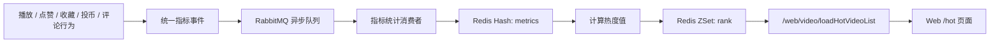

# 视频热度排行榜模块

## 需求背景

本次新增 Web 端实时累计视频热榜，用于在 `/hot` 页面展示当前站内热视频。热度不再只依赖单一播放量，而是综合播放量、点赞量、收藏量、投币量、评论量五类行为指标计算，并通过 RabbitMQ 异步削峰，避免播放、点赞、收藏、投币、评论主流程被排行榜缓存写入拖慢。

榜单口径为实时累计榜，不做 24 小时滑动窗口和时间衰减。播放行为在用户开始播放时上报，同一 `deviceId + videoId` 默认 30 分钟内只计一次。

## 实现概要

后端按职责拆成两个模块：

- 指标统计模块：播放、点赞、收藏、投币、评论先统一封装为指标事件，通过 RabbitMQ 投递；消费者幂等消费后聚合到 Redis Hash。
- 排名计算模块：读取 Redis Hash 中的播放量、点赞量、收藏量、投币量、评论量，按固定公式计算热度值，再写入 Redis ZSet 排行榜。

数据流如下：



热度公式固定为：

```text
heatScore = playCount * 1 + likeCount * 5 + collectCount * 5 + coinCount * 6 + commentCount * 8
```

## 核心改动文件

### 后端

- `echo-space-backend/internal/domain/video_hot.go`
  - 新增热榜指标事件、指标快照、排行榜返回项等结构。
- `echo-space-backend/internal/infra/cache/video_hot_store.go`
  - 新增 Redis Hash、ZSet、播放去重、事件幂等封装。
- `echo-space-backend/internal/infra/mq/video_hot_metric.go`
  - 新增热度指标事件发布者和消费者。
- `echo-space-backend/internal/service/web/video_hot_service.go`
  - 新增指标统计服务和排名计算服务。
  - 实现播放上报去重、指标事件构造、消费聚合、热度计算、ZSet 分页、DB 回算。
- `echo-space-backend/internal/repository/video_repository.go`
  - 新增播放量增量更新、热榜指标快照查询、DB 降级热榜分页查询。
- `echo-space-backend/internal/repository/interact_repository.go`
  - 点赞、收藏、投币返回本次视频计数变化量，供指标事件使用。
- `echo-space-backend/internal/service/web/user_action_service.go`
  - 点赞、取消点赞业务成功后投递 `like +1/-1` 指标事件。
  - 收藏、取消收藏业务成功后投递 `collect +1/-1` 指标事件。
  - 投币业务成功后投递 `coin +actionCount` 指标事件。
- `echo-space-backend/internal/service/web/comment_service.go`
  - 一级评论创建成功后投递 `comment +1` 指标事件。
- `echo-space-backend/internal/http/handler/web/video_handler.go`
  - 新增游客可访问热榜列表接口处理。
- `echo-space-backend/internal/http/handler/web/online_handler.go`
  - 新增播放热度上报接口处理。
- `echo-space-backend/internal/http/router/web.go`
  - 注册热榜列表与播放热度上报路由。
- `echo-space-backend/internal/app/app.go`
  - 组装热榜 Redis Store、MQ 发布者/消费者、启动/定时回算任务。
- `echo-space-backend/internal/config/config.go`
  - 新增热榜和 MQ 队列配置。
- `echo-space-backend/configs/application.yaml`
  - 新增热榜默认配置项。
- `echo-space-backend/internal/service/web/video_hot_service_test.go`
  - 覆盖热度公式、播放上报入参清洗、事件校验等逻辑。
- `echo-space-backend/internal/http/router/router_test.go`
  - 覆盖新增游客接口不强制登录。

### 前端

- `echo-space-frontend-web/src/views/hot/Hot.vue`
  - 复用现有 `/hot` 页面和 `VideoItem` 视频卡片。
  - 接入热榜接口，展示 `rank` 和 `heatScore`。
  - 保留分页加载、加载中、空状态。
- `echo-space-frontend-web/src/components/Player.vue`
  - 播放开始时上报一次热度播放事件。
  - 页面实例内按视频去重，避免同一视频重复切换播放状态时重复上报。
- `echo-space-frontend-web/src/utils/Api.js`
  - 新增播放热度上报接口地址。

## 接口变化

### 热榜列表

- 路径：`GET /web/video/loadHotVideoList`
- 兼容：`POST /web/video/loadHotVideoList`
- 登录要求：游客可访问
- 参数：

| 参数 | 类型 | 默认值 | 说明 |
| --- | --- | --- | --- |
| `pageNo` | number | `1` | 页码，从 1 开始 |
| `pageSize` | number | `20` | 每页数量，最大 `50` |

返回数据复用现有分页结构，列表项复用视频卡片字段，并额外增加：

| 字段 | 类型 | 说明 |
| --- | --- | --- |
| `rank` | number | 当前榜单排名 |
| `heatScore` | number | 热度值 |

### 播放热度上报

- 路径：`GET /interact/online/reportVideoPlayHot`
- 兼容：`POST /interact/online/reportVideoPlayHot`
- 登录要求：游客可访问
- 参数：

| 参数 | 类型 | 说明 |
| --- | --- | --- |
| `videoId` | string | 视频 ID |
| `deviceId` | string | 设备 ID，用于短期播放去重 |

后端按 `deviceId + videoId` 写 Redis 去重 Key，默认 30 分钟内只计一次播放热度。Redis 或 MQ 异常时只记录日志，不影响播放主流程。

## 指标事件

统一事件结构：

| 字段 | 类型 | 说明 |
| --- | --- | --- |
| `eventId` | string | 事件唯一 ID，用于消费幂等 |
| `videoId` | string | 视频 ID |
| `eventType` | string | 指标类型：`play`、`like`、`collect`、`coin`、`comment` |
| `delta` | number | 指标增量 |
| `occurredAt` | datetime | 事件发生时间 |

事件规则：

- 播放开始：`play +1`
- 点赞成功：`like +1`
- 取消点赞成功：`like -1`
- 收藏成功：`collect +1`
- 取消收藏成功：`collect -1`
- 投币成功：`coin +actionCount`
- 一级评论创建成功：`comment +1`

评论回复本期不计入评论热度指标，避免回复楼中楼导致评论热度被放大。

## Redis 变化

### 指标 Hash

- Key：`echo-space:video:hot:metrics:{videoId}`
- 字段：

| 字段 | 说明 |
| --- | --- |
| `playCount` | 播放量 |
| `likeCount` | 点赞量 |
| `collectCount` | 收藏量 |
| `coinCount` | 投币量 |
| `commentCount` | 评论量 |

消费者聚合指标时使用 Redis 原子脚本递增，并对负数结果做兜底保护，避免取消点赞、取消收藏等负向事件把指标扣到 0 以下。

### 排行榜 ZSet

- Key：`echo-space:video:hot:rank`
- Member：`videoId`
- Score：`heatScore`

查询时按 Score 倒序分页，并回查 MySQL 获取已审核通过、未删除、可见的视频卡片字段。

### 播放去重 Key

- Key：`echo-space:video:play:dedupe:{videoId}:{deviceId}`
- TTL：默认 30 分钟

### 消费幂等 Key

- Key：`echo-space:video:hot:event:{eventId}`
- TTL：默认 7 天

## RabbitMQ 变化

- 队列名：`echo-space.video.hot.metric`
- 配置项：`rabbitmq.videoHotMetricQueue`
- 消息体：统一指标事件 JSON
- 消费策略：
  - 消费前先校验事件字段。
  - 使用 Redis 幂等 Key 防止重复消费。
  - 消费成功后确认消息。
  - 处理失败返回错误，由现有消费者流程决定重试。

如果 RabbitMQ 未配置或发布失败，服务会尝试降级为本进程直接处理事件；若 Redis 同时不可用，则只记录日志，不阻塞原播放、点赞、收藏、投币、评论流程。

## 配置变化

`configs/application.yaml` 新增：

```yaml
rabbitmq:
  videoHotMetricQueue: echo-space.video.hot.metric

videoHot:
  metricsKeyPrefix: echo-space:video:hot:metrics:
  rankKey: echo-space:video:hot:rank
  playDedupeTTL: 30m
  backfillInterval: 30m
```

支持环境变量覆盖：

- `RABBITMQ_VIDEO_HOT_METRIC_QUEUE`
- `VIDEO_HOT_METRICS_KEY_PREFIX`
- `VIDEO_HOT_RANK_KEY`
- `VIDEO_HOT_PLAY_DEDUPE_TTL`
- `VIDEO_HOT_BACKFILL_INTERVAL`

## 数据库变化

本次不新增表、不新增字段、不启用 AutoMigrate。

MySQL 原有计数字段继续保留：

- 播放指标消费成功后，会同步增量更新 `video_info.play_count`。
- 点赞、收藏、投币、评论的 MySQL 计数仍由原业务事务维护。
- Redis 或 ZSet 不可用时，热榜接口会使用 MySQL 原有计数字段按同一热度公式降级查询。

## 回算与降级

应用启动后会触发一次热榜回算，并按 `videoHot.backfillInterval` 周期性从 `video_info` 批量读取播放量、点赞量、收藏量、投币量、评论量，回写 Redis Hash 和 ZSet。

降级策略：

- 播放上报 Redis 去重失败：记录日志，主流程返回成功。
- MQ 发布失败：记录日志，并尝试直接处理事件。
- Redis Hash/ZSet 写入失败：记录日志，等待后续回算修复。
- 热榜 ZSet 查询失败或为空：使用 MySQL 原字段按公式降级返回。

## 前端表现

Web 端 `/hot` 页面继续使用现有布局和视频卡片组件：

- 首次进入自动请求热榜接口。
- 下滑继续按 `pageNo/pageSize` 分页加载。
- 视频卡片上方展示 `NO.{rank}` 和 `{heatScore} 热度`。
- 无数据时展示空状态文案。
- 视频播放器开始播放时调用播放热度上报接口，失败不打断视频播放。

## 验证方式

已执行：

```bash
cd echo-space-backend
go test ./...
```

结果：通过。

已执行：

```bash
cd echo-space-frontend-web
npm run build
```

结果：通过。构建过程中存在项目已有的 Sass legacy API、空 chunk、图片路径提示等非阻断警告，本次热榜改动未引入新的构建错误。

建议联调验证：

- 同一设备 30 分钟内重复播放同一视频，只增加一次播放热度。
- 点赞后 `likeCount` 增加，取消点赞后 `likeCount` 减少，ZSet 分数随之变化。
- 创建一级评论后 `commentCount` 增加，回复评论不增加热度评论指标。
- 收藏后 `collectCount` 增加，取消收藏后 `collectCount` 减少，ZSet 分数随之变化。
- 投币后 `coinCount` 按投币数量增加，ZSet 分数随之变化。
- 关闭 Redis 或 RabbitMQ 时，播放、点赞、收藏、投币、评论主流程不崩溃；恢复后可通过启动/定时回算修复热榜缓存。

## 遗留风险

- 当前榜单是实时累计榜，热门内容会长期累积优势；如果后续要做“24 小时热榜”，需要新增时间窗口桶或滑动窗口设计。
- 回算任务直接从 `video_info` 分批读取历史数据，数据量很大时可继续优化为游标扫描、限速或独立补偿任务。
- 本期没有引入本地消息表，MQ 和 Redis 同时异常时，热榜缓存可能短暂滞后，最终依赖 MySQL 降级查询和周期回算修复。
